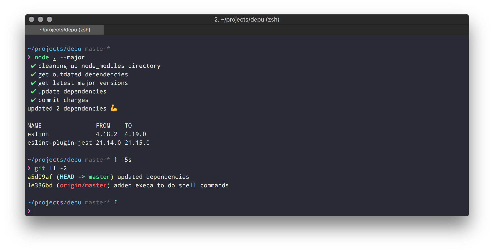

# depu

[![build status][travis-image]][travis-url]
[![coverage status][codecov-image]][codecov-url]

automatically update dependencies of your NodeJS application

## Usage

```bash
npx depu [--major|minor|patch] [--prefix="@myNamespace"]
```

depu will
* cleanup node_modules to ensure dependencies are matching package.json (`npm prune`)
* look for outdated packages (`npm outdated`)
* look for available versions (`npm view myPackage version`)
* install newer packages with `npm install myPackage@1.2.3` which also updates the package.json
* commit the updated package.json and package-lock.json (`git commit -m "updated dependencies`)



## License

MIT

[travis-image]: https://img.shields.io/travis/bseber/depu.svg?style=flat-square
[travis-url]: https://travis-ci.org/bseber/depu
[codecov-image]: https://img.shields.io/codecov/c/github/bseber/depu.svg?style=flat-square
[codecov-url]: https://codecov.io/gh/bseber/depu
